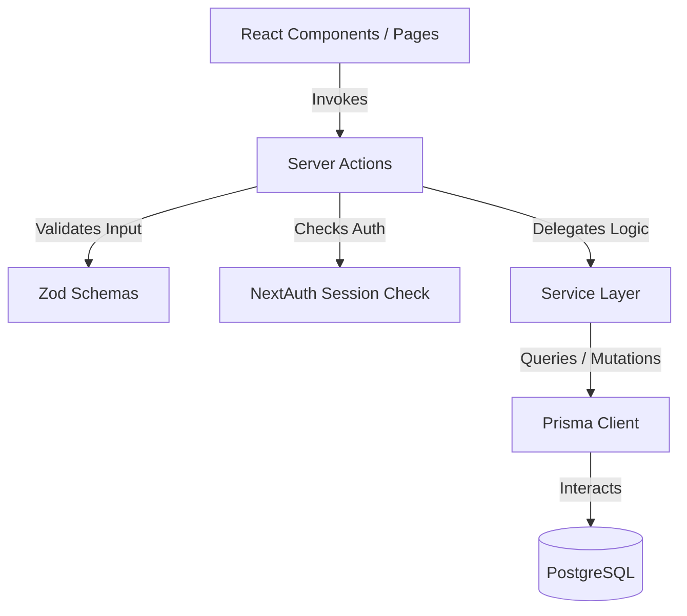

# Developer Agent Guide (`AGENTS.md`)

This guide is designed for AI coding agents (such as Google Antigravity) and human developers working on the **Blog-JS** project. It outlines the project's technical architecture, developer workflows, testing strategies, coding constraints, and directory mapping.

---

## 🏗️ Project Architecture

**Blog-JS** is a modern full-stack blog platform built with Next.js 15, React 19, and Prisma. It splits features into a public blog site and an admin dashboard.

### 🔑 Key Patterns & Architecture Guidelines

> [!IMPORTANT]
> **Rule 1: Service Layer Pattern**
> All core domain and business logic **MUST** reside inside the service layer (`./lib/services/`).
> - **Do NOT** perform direct database queries (using `prisma.*`) or write complex business rules inside Server Actions or page components.
> - **Server Actions** (`./app/actions/`) are only responsible for authentication checks, validation (via Zod), calling services, and executing route caching/redirection operations (`revalidatePath`, `redirect`).

> [!TIP]
> **Rule 2: Boundary Validations**
> Always define and validate payload types with **Zod** at entry points (like Server Actions or API routes) before invoking domain services.

> [!WARNING]
> **Rule 3: Authentication and Authorization**
> NextAuth handles authentication. Ensure any administrative route or action verifies that the user is authenticated and has the `"admin"` role using `getServerSession(authOptions)` and middleware protection.

> [!NOTE]
> **Rule 4: Styling Conventions**
> The project uses **Tailwind CSS** for layout, typography, and styling. Shared design system primitives reside under `./components/ui/` (e.g., `Button`, `Input`, `Card`, `label`, `textarea`, `select`, `alert`, `dialog`, `table`). Avoid creating legacy CSS Modules (`*.module.css`); compile all visual components using Tailwind's styling tokens and utility classes.

---

## 📁 Directory Structure & Key Files

For a quick reference of the codebase:

*   **Database Schema & Seed**:
    *   [`prisma/schema.prisma`](./prisma/schema.prisma) — Database models (Post, Subscriber, Message, SocialLink, User).
    *   [`prisma/seed.js`](./prisma/seed.js) — Populates local development database with sample data.
*   **Service Layer (Domain Logic)**:
    *   [`lib/services/postService.ts`](./lib/services/postService.ts) — Management of posts, slug lookups, and feature toggles.
    *   [`lib/services/userService.ts`](./lib/services/userService.ts) — Authentication, password hashing, and user role lookups.
    *   [`lib/services/messageService.ts`](./lib/services/messageService.ts) — User message collection and handling.
    *   [`lib/services/subscriberService.ts`](./lib/services/subscriberService.ts) — Newsletter subscription operations.
    *   [`lib/services/socialService.ts`](./lib/services/socialService.ts) — Administration of social profile links.
*   **Entrypoints & Handlers**:
    *   [`app/actions/admin.ts`](./app/actions/admin.ts) — Server actions for managing administration functions.
    *   [`app/actions/public.ts`](./app/actions/public.ts) — Public-facing form submission and post interaction actions.
*   **Configuration**:
    *   [`lib/auth.ts`](./lib/auth.ts) — NextAuth.js handler setup.
    *   [`lib/prisma.ts`](./lib/prisma.ts) — Prisma Client initialization singleton.
    *   [`next.config.ts`](./next.config.ts) — Next.js platform settings.
*   **UI Components & Shared Primitives**:
    *   [`components/ui/`](./components/ui) — Shared design system primitives built with Tailwind CSS.

---

## 💻 Essential Commands

Here is a list of commands you can use to develop, sync, and test:

| Command | Script / Target | Description |
| :--- | :--- | :--- |
| **`npm install`** | Dependency Setup | Installs all Node modules and runs `prisma generate` post-install. |
| **`npm run dev:local`** | [`scripts/dev.sh`](./scripts/dev.sh) | Starts Docker PostgreSQL, pushes database schema changes, seeds the database, and boots up the Next.js development server. |
| **`npm run db:sync`** | [`scripts/sync-db.sh`](./scripts/sync-db.sh) | Synchronizes your local database schema with Prisma definition. |
| **`npm run test`** | Vitest Runner | Runs the unit and integration test suite. |
| **`npm run lint`** | ESLint | Lints code syntax and styling patterns. |

---

## 🧪 Testing Guidelines

This codebase uses **Vitest** and **React Testing Library** for testing. 

*   Tests are located within `__tests__` directories relative to their files (e.g., `./lib/services/__tests__/`, `./app/actions/__tests__/`).
*   **Database Mocking**: Unit tests do not hit a live database. Database operations are mocked using `vitest-mock-extended` for `PrismaClient` (configured in [`vitest.setup.ts`](./vitest.setup.ts)).
*   **Routing & Authentication Mocking**: `next/navigation` and `next-auth` are fully mocked in the test setup.
*   **React 19 Hooks**: `useActionState` and `useTransition` are mocked in [`vitest.setup.ts`](./vitest.setup.ts) to enable offline testing without a full Next.js server environment.

When writing or modifying tests, ensure that you mock relevant service responses instead of relying on actual database states. Run the test suite (`npm run test`) regularly to confirm updates did not break existing behavior.
